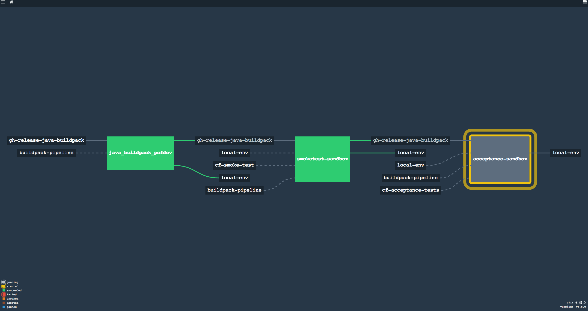

# Description

This repository containt an example of buildpack integration pipeline and could be easily customize to fit
your requirement of course using [Concourse CI](http://concourse.ci/) 





## Change with the v1.
We are now doing a pipeline by buildpack, this is more flexible and more portable.

We stop using env-conf, but we use the [pool-resource](https://github.com/concourse/pool-resource) this have two advantage :

* Lock environment (like pcfdev) to run one buildpack pipeline at the time
* Pass the environment configuration (replacing env-conf use in v1)

#### Docker Images used
We use the docker image [getourneau/alpine-cfcli-golang](https://github.com/shinji62/alpine-docker-cfcli-golang) 
Which contain the CF cli and golang on a an image based on alpine linux

## Resources

### Buildpack resource
We use the Github release of buildpack.
```yaml
- name: gh-release-binary-buildpack
  type: github-release
  source:
    user: cloudfoundry
    repository: binary-buildpack
    access_token: {{github-access-token}}
```

### Environment configuration and Lock
Most of the time there are multiple environment like PROD, STG, DEV and so on.
We use the github repository and the [pool-resource](https://github.com/concourse/pool-resource) to specify multiple env, and smoke test config and lock the pipeline by env.

You can take a look here [pool-concourse-config](hhttps://github.com/shinji62/pool-concourse-config)
```yaml
- name: local-env
  type: pool
  source:
    uri: git@github.com:shinji62/pool-concourse-config.git
    branch: master
    pool: local
    private_key: {{private-key-github-concourse}}
```

Enviroment config file example

```json
{
    "env": {
        "api": "api.local.pcfdev.io",
        "apps_domain": "local.pcfdev.io",
        "password": "admin",
        "user": "admin"
    },
    "smoke_test": {
        "backend": "diego",
        "cleanup": true,
        "enable_windows_tests": false,
        "logging_app": "",
        "org": "CF-SMOKE-ORG",
        "runtime_app": "",
        "skip_ssl_validation": true,
        "space": "CF-SMOKE-SPACE",
        "suite_name": "CF_SMOKE_TESTS",
        "use_existing_org": false,
        "use_existing_space": false
    }
}
```


## Job
Job are pretty easy you can just take a look at the pipeline

### Buildpack uploading
`BUILDPACK_NAME` is the name of the buildpack in cloudfoundry 
`DOWNLOADED_BUILDPACK_NAME` is the name of the downloaded builpack (prefix of the name ex java-buildpack-offline.zip we will use java-buildpack) by default this value is the same as `BUILPACK_NAME`

* Important if the buildpack is already uploaded we consider the job as passed (Green status). 

```yaml
jobs:
- name: go_buildpack_pcfdev
  public: true
  serial: true
  plan:
  - aggregate:
    - get: buildpack-github-release
      resource: gh-release-go-buildpack
      params:
        globs:
          - "*cached*"
      trigger: true
    - put: env-info
      resource: local-env
      params: {acquire: true}
    - get: buildpack-pipeline
  - task: upload-go-buildpack
    file: buildpack-pipeline/ci/updatebuildpack/updatebuildpack.yml
    params:
      BUILDPACK_NAME: go_buildpack
    on_failure:
      put: env-info
      resource: local-env
      params: {release: env-info}
```


### Smoke test and Acceptance Test
There is currently two type of test, [smoke-test](https://github.com/cloudfoundry/cf-smoke-tests) and [acceptance-test](https://github.com/cloudfoundry/cf-acceptance-tests) from Cloudfoundry

Important
* smoke-test can be run in any environment.
* Acceptance-test are more aggressive and should be run in non-production env.


```yaml
- name: acceptance-sandbox
  public: true
  serial: true
  plan:
  - aggregate:
    - get: acceptance-tests
      resource: cf-acceptance-tests
    - get: gh-release-java-buildpack
      trigger: true
      passed: [smoketest-sandbox]
    - get: env-info
      resource: local-env
    - get: buildpack-pipeline 
  - task: acceptance-tests
    file: buildpack-pipeline/ci/acceptancetests/acceptancetests.yml
    ensure:
      put: env-info
      resource: local-env
      params: {release: env-info}
```


## Usage
Deploy to concourse is easy as 
```bash
fly -t target set-pipeline -c ci/(BUILDPACK_NAME)_buildpack.yml --load-vars-from credentials.yml -p (BUILDPACK_NAME)-pipeline
```

`BUILDPACK_NAME` is the name of the buildpack you want to use.


